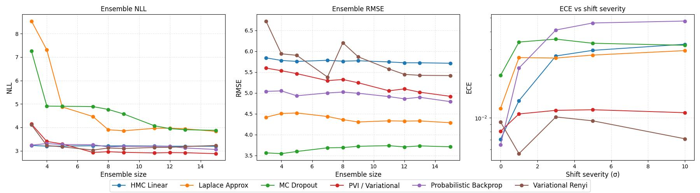
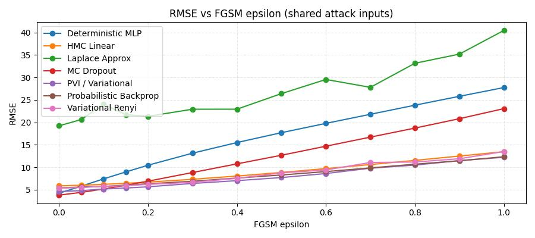

# Bayesian Ensembling in Practice
## Why Bayesian ensembling?
```md
    link to project: https://github.com/intsystems/bensemble/tree/master
```

Imagine the usual story. You train a neat regression network, the validation curve behaves, the RMSE looks respectable. On the test set everything seems fine, so you feel safe. Then you move to slightly shifted data, or to some corner of the feature space that was barely covered during training, and suddenly the model is confidently wrong.

The issue is not only the prediction itself, but the lack of an honest “I don’t know.” A standard neural network gives a single parameter vector $\boldsymbol{\theta}^\star$ and a single prediction $f_{\boldsymbol{\theta}^\star}(\mathbf{x})$ for each input. All uncertainty is hidden inside early stopping heuristics, random seeds and architecture choices.

The Bayesian view starts from a simple observation: if there are many weight configurations that explain the data reasonably well, we should not pretend that one of them is the truth. Instead we keep a distribution over weights,

$$
p(\boldsymbol{\theta} \mid \mathcal{D}) \propto p(\boldsymbol{\theta})p(\mathcal{D} \mid \boldsymbol{\theta}),
$$

and make predictions by averaging over many plausible networks,

$$
p(y \mid \mathbf{x}, \mathcal{D})
= \int p(y \mid \mathbf{x}, \boldsymbol{\theta}) p(\boldsymbol{\theta} \mid \mathcal{D}) d\boldsymbol{\theta}.
$$

This already explains why Bayesian models tend to be more cautious off-distribution: if different networks in the posterior disagree, the averaged prediction becomes uncertain.

For deep networks this integral is intractable, so in practice we approximate the posterior with something tractable, call it $q(\boldsymbol{\theta})$, draw samples

$$
\boldsymbol{\theta}^{(1)},\dots,\boldsymbol{\theta}^{(M)} \sim q(\boldsymbol{\theta}),
$$

and treat them as an ensemble. The core theme of this project is exactly that: build several approximate Bayesian neural networks, sample model ensembles from each of them, and compare their uncertainty behaviour in a controlled way.

The four methods we focus on are:

* Probabilistic Backpropagation (PBP),
* Laplace approximation,
* variational Rényi inference,
* a practical variational inference (PVI) scheme based on Bayesian linear layers.

They all target the same object $p(y \mid \mathbf{x}, \mathcal{D})$, but they approximate $p(\boldsymbol{\theta} \mid \mathcal{D})$ in very different ways.

---

## A minimal Bayesian template
To keep the notation compact, let $\boldsymbol{\theta}$ be parameters and $\mathcal{D} = \{\mathbf{x}n, yn\}^N{n=1}$. We assume

$$
p(\mathcal{D} \mid \boldsymbol{\theta}) = \prod_{n=1}^N p(y_n \mid \mathbf{x}_n, \boldsymbol{\theta}),
$$

with a Gaussian likelihood for regression, and a prior $p(\boldsymbol{\theta})$.

The exact posterior and predictive distribution are

$$
p(\boldsymbol{\theta} \mid \mathcal{D}) \propto p(\boldsymbol{\theta}) p(\mathcal{D} \mid \boldsymbol{\theta}),
\qquad
p(y \mid \mathbf{x}, \mathcal{D}) = \int p(y \mid \mathbf{x}, \boldsymbol{\theta}) p(\boldsymbol{\theta} \mid \mathcal{D}), d\boldsymbol{\theta}.
$$

All methods in this project fit into the same approximation pattern. We pick an approximate posterior $q(\boldsymbol{\theta})$ and use Monte Carlo,

$$
p(y \mid \mathbf{x}, \mathcal{D})
\approx \frac{1}{M} \sum_{m=1}^M p\bigl(y \mid \mathbf{x}, \boldsymbol{\theta}^{(m)}\bigr),
\qquad
\boldsymbol{\theta}^{(m)} \sim q(\boldsymbol{\theta}).
$$

The only question is how we define $q(\boldsymbol{\theta})$ and how we learn it from data.

---

## [Probabilistic Backpropagation](https://arxiv.org/pdf/1502.05336)

Probabilistic Backpropagation (PBP) pushes the classical “uncertainty in weights” idea quite literally. Instead of a single value for each weight, PBP maintains a Gaussian

$$
w_i \sim \mathcal{N}(m_i, v_i),
$$

and similarly treats noise and weight precisions as random, with Gamma posteriors. It is implemented for regression with a Gaussian likelihood.

Conceptually, for each input $\mathbf{x}$ the network does not produce a single scalar $f_{\boldsymbol{\theta}}(\mathbf{x})$, but an approximate predictive distribution

$$
p(y \mid \mathbf{x}, q) \approx \mathcal{N}\bigl(y \mid \mu(\mathbf{x}), \sigma^2(\mathbf{x})\bigr),
$$

where $\mu(\mathbf{x})$ and $\sigma^2(\mathbf{x})$ arise from propagating means and variances through the network layers. Nonlinearities such as ReLU are handled by moment-matching: we approximate the output of ReLU under a Gaussian input by another Gaussian whose mean and variance are computed analytically.

Learning then proceeds in an assumed density filtering style. For each data point, we take the current approximate posterior $q_{\text{old}}(\boldsymbol{\theta})$, multiply it by the likelihood of that point, and project the result back to the Gaussian family:

$$
q_{\text{new}}(\boldsymbol{\theta}) \propto q_{\text{old}}(\boldsymbol{\theta}) p(y \mid \mathbf{x}, \boldsymbol{\theta})
\quad \text{(projected back to Gaussians)}.
$$

The end result is a factorized Gaussian over weights plus Gamma distributions over hyperparameters. From that, sampling full networks is straightforward: draw weights from the Gaussians, plug them into a standard multilayer perceptron, and you have a concrete ensemble member.

---

## [Laplace approximation](https://openreview.net/pdf?id=Skdvd2xAZ)

The Laplace approximation starts from a different angle. Instead of designing a Bayesian method from scratch, you begin with a network that has already been trained in the usual deterministic way, with weight decay capturing the prior. Let

$$
\ell(\boldsymbol{\theta}) = -\log p(\boldsymbol{\theta} \mid \mathcal{D})
= -\log p(\boldsymbol{\theta}) - \log p(\mathcal{D} \mid \boldsymbol{\theta}),
$$

and let $\boldsymbol{\theta}^\star$ be the trained weights, approximately minimizing $\ell$.

Laplace assumes that, near $\boldsymbol{\theta}^\star$, the posterior can be approximated by a Gaussian. Expanding $\ell$ in a second-order Taylor series gives

$$
\ell(\boldsymbol{\theta}) \approx \ell(\boldsymbol{\theta}^\star)\tfrac{1}{2} (\boldsymbol{\theta} - \boldsymbol{\theta}^\star)^\top \mathbf{H} (\boldsymbol{\theta} - \boldsymbol{\theta}^\star),
$$

with $\mathbf{H}$ a curvature matrix at $\boldsymbol{\theta}^\star$ (Hessian or Gauss–Newton). This corresponds to a Gaussian approximation

$$
q(\boldsymbol{\theta}) = \mathcal{N}\bigl(\boldsymbol{\theta}^\star, \mathbf{H}^{-1}\bigr).
$$

For modern networks, $\mathbf{H}$ is far too large to store explicitly, so we use a Kronecker-factored approximation layer-wise. Roughly speaking, for a linear layer with input activations $\mathbf{x}$ and pre-activation Hessian $\mathbf{H}_z$, the curvature block is approximated as

$$
\mathbf{H}_{\text{weights}}
\approx \mathbb{E}[\mathbf{x} \mathbf{x}^\top] \otimes \mathbb{E}[\mathbf{H}_z],
$$

a Kronecker product of two much smaller matrices. This structure makes it feasible to invert the covariance and to sample weight matrices for each layer.

The attractive part is that no special training procedure is required: you can take any existing MLP, fit a Laplace approximation around its optimum, and immediately turn it into a Bayesian ensemble by drawing curvature-aware perturbations of its weights.

---

## [Variational Rényi inference](https://arxiv.org/pdf/1602.02311)

Variational Rényi inference keeps the spirit of standard variational inference but replaces the usual KL divergence by a whole family of divergences indexed by $\alpha$.

Rényi’s $\alpha$-divergence between $p$ and $q$ is

$$
D_\alpha(p \Vert q)
= \frac{1}{\alpha - 1}
\log \int p(\boldsymbol{\theta})^\alpha q(\boldsymbol{\theta})^{1-\alpha} d\boldsymbol{\theta}.
$$

When $\alpha \to 1$, this reduces to the familiar $D_{\mathrm{KL}}(p \Vert q)$. Different values of $\alpha$ emphasize different aspects of the posterior: some are more mass-covering, others more mode-seeking.

In the implemented version, the approximate posterior $q(\boldsymbol{\theta})$ is a factorized Gaussian over layer weights. The central quantity is the importance weight

$$
w(\boldsymbol{\theta}) = \frac{p(\boldsymbol{\theta}, \mathcal{D})}{q(\boldsymbol{\theta})},
$$

and the Rényi-style objective

$$
\mathcal{L}*\alpha(q)
= \frac{1}{1-\alpha}
\log \mathbb{E}_{q(\boldsymbol{\theta})} \bigl[
w(\boldsymbol{\theta})^{1-\alpha}
\bigr].
$$

This is approximated by Monte Carlo using samples $\boldsymbol{\theta}^{(k)}$ drawn via a reparameterization trick. When $\alpha = 1$, the bound collapses to the usual evidence lower bound (ELBO); for $\alpha \neq 1$, we get a continuum of alternative objectives.

Qualitatively, this gives a knob that controls how aggressive or conservative the variational approximation is. Once trained, sampling networks is as simple as drawing from the Gaussian $q(\boldsymbol{\theta})$ and plugging the sampled weights into the base model.

---

## [Practical variational inference](https://papers.nips.cc/paper_files/paper/2011/file/7eb3c8be3d411e8ebfab08eba5f49632-Paper.pdf)

The practical variational inference (PVI) component in the project follows the “Bayesian layers’’ approach: instead of treating the whole network as a single variational object, it replaces ordinary linear layers by Bayesian linear layers and adds a simple Gaussian likelihood on top.

Each weight in a linear layer is modeled as

$$
w_{ij} \sim \mathcal{N}(\mu_{ij}, \sigma_{ij}^2),
$$

with a fixed Gaussian prior $p(\mathbf{w})$. Instead of sampling each weight independently at every step, PVI uses the local reparameterization trick: it samples directly in activation space. For an input mini-batch, the pre-activation means and variances are

$$
\boldsymbol{\gamma} = \mathbf{x} \mathbf{W}*\mu^\top,
\qquad
\boldsymbol{\delta} = \mathbf{x}^2 \mathbf{W}*\sigma^2{}^\top + \text{bias term},
$$

and activations are drawn as

$$
\mathbf{z} = \boldsymbol{\gamma} + \boldsymbol{\epsilon} \odot \sqrt{\boldsymbol{\delta}},
\quad
\boldsymbol{\epsilon} \sim \mathcal{N}(\mathbf{0}, \mathbf{I}).
$$

The loss function is a standard variational one:

$$
\mathcal{L}
= \mathbb{E}_{q(\boldsymbol{\theta})}[-\log p(\mathcal{D} \mid \boldsymbol{\theta})]

* \lambda_{\mathrm{KL}}, D_{\mathrm{KL}}\bigl(q(\boldsymbol{\theta}) ,\Vert, p(\boldsymbol{\theta})\bigr),
  $$

where $p(\mathcal{D} \mid \boldsymbol{\theta})$ is a Gaussian likelihood with learnable noise scale and the KL term is a sum of closed-form divergences for each Bayesian linear layer. This is conceptually close to “Bayes by Backprop’’ but with a variance-reduction trick that makes training more stable.

After training, one can either keep sampling activations on the fly to get predictive distributions or freeze individual weight samples to obtain a more classical ensemble of deterministic networks.

---

## Seeing the methods in action

The math above is intentionally light; the interesting part is how these methods actually behave on real data. Two notebooks in the project are central for that.

The first is [demos](https://github.com/intsystems/bensemble/tree/master/notebooks), which focuses on library's interface and its capabilities.

The second is [`benchmark`](https://github.com/intsystems/bensemble/blob/master/notebooks/benchmark.ipynb). This is the main playground where all four methods (PBP, Laplace, Rényi VI, PVI) are compared on the same dataset and with the same metrics against 3 baselines: a deterministic multilayer perceptron, an MC Dropout variant and a small HMC-based Bayesian linear model. 

Also we compared methods against an adversarial attack. 


---

## Conclusion

The project deliberately stays away from exotic new architectures. Instead it takes four representative approximations to Bayesian neural networks, puts them into a shared interface, and asks a simple question: if we look at their predictions as ensembles, how do they differ in terms of uncertainty?

Probabilistic Backpropagation uses moment propagation and ADF updates to maintain a Gaussian over weights and noise. Laplace starts from a deterministic optimum and wraps it with a curvature-based Gaussian. Variational Rényi inference plays with the divergence itself, using an $\alpha$-parameter to move between different approximations. Practical variational inference builds Bayesian behaviour into the layers and uses a classical variational loss with a KL penalty.

All of them aim at the same conceptual object: the Bayesian predictive distribution that averages over plausible parameter values instead of trusting a single network. The value of having them in a single codebase, with common notebooks and metrics, is that these differences stop being abstract and become visible: in calibration plots, in OOD behaviour, and in how fast confidence grows once the model leaves the comfort zone of the training data.
