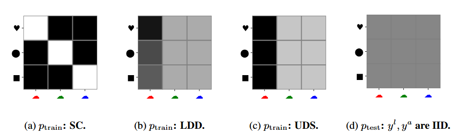

# Distribution Shift in Practice: Strong Baselines vs. Clever Tricks

You train a model. Loss goes down, validation looks healthy, test accuracy clears whatever bar you set. Then you roll it out to a new hospital, or a new city, or a slightly different camera, and suddenly it behaves like you trained it on static.

We throw the phrase *“distribution shift”* at this and move on.

The paper **“A Fine-Grained Analysis on Distribution Shift” (Wiles et al.)** slows down and asks a much more useful question:

> If we define distribution shift in a clean, explicit way, and we actually benchmark a lot of methods under that definition, what survives, and what quietly does nothing?

To get there, they build a small but sharp probabilistic picture of the world, centered around **attributes**, and then use that to organise both datasets and methods.

---

## Latent factors: the world underneath your dataset

Forget methods for a moment. Imagine there is some hidden state of the world, a vector of latent factors $\mathbf{z}$:

The generative story looks like this:

1. Sample latent factors  
   $$
   \mathbf{z} \sim p(\mathbf{z}).
   $$
2. From $\mathbf{z}$, generate discrete attributes  
   $$
   y^k \sim p(y^k \mid \mathbf{z}), \quad k = 1,\dots,K.
   $$
   Here the $y^k$ are things like “shape”, “color”, “hospital ID”, “camera location”.
3. From the same $\mathbf{z}$, generate the image  
   $$
   \mathbf{x} \sim p(\mathbf{x} \mid \mathbf{z}).
   $$

If you marginalise out $\mathbf{z}$, you get a joint density
$$
p(\mathbf{x}, y^1,\dots,y^K)
=
p(y^1,\dots,y^K)\, p(\mathbf{x} \mid y^1,\dots,y^K).
$$

The important part is the split: one term only talks about **attributes** $p(y^1,\dots,y^K)$, the other term is “how the world looks if those attributes are fixed”, $p(\mathbf{x} \mid y^{1:K})$.

The main assumption in the paper is:

> Between train and test, the **world** does not change, so $p(\mathbf{x} \mid y^{1:K})$ is fixed. What changes is only **how often** different attribute combinations appear:
> $$p_{\text{train}}(y^{1:K}) \neq p_{\text{test}}(y^{1:K}).$$

So distribution shift, in this story, is literally “we sample different regions of latent space and different mixtures of attributes”.

---

### Attributes: label vs nuisance

From that latent world you now decide which parts you care about.

Among the discrete attributes $y^1,\dots,y^K$, you pick one as the **label** $y^\ell$ (what you’re actually predicting: tumor vs normal, species, shape, …), one as the **nuisance attribute** $y^a$ (hospital ID, camera location, color, viewpoint, …).

---

### Three ways to break the joint $p(y^\ell, y^a)$

Once you fix a label $y^\ell$ and a nuisance attribute $y^a$, there are many ways to mess with their joint distribution. The paper focuses on three basic ones.

**Spurious correlation (SC).**  
On the training split, $y^\ell$ and $y^a$ are strongly correlated. On the test split, they are roughly independent. Model sees “tumor almost always at hospital A”, “normal almost always at hospital B” in train, and then suddenly hospitals are mixed at test.

**Low-data drift (LDD).**  
Some values of $y^a$ are extremely rare in train but common in test. That might be one camera location, or one particular color, or one hospital. 

**Unseen data shift (UDS).**  
The extreme case: some attribute values are completely missing in training, but present in test. New hospital. New camera. New city.

On top of that, they sometimes flip labels with a fixed noise rate and shrink/grow the total dataset size, just to see how sensitive each method is when supervision is messy or scarce.

---

### Datasets and methods, without drowning in details

To actually see how methods behave under these shifts, the authors need a playground where attributes are visible.

On the synthetic side, they use  dSprites, Shapes3D, and MPI3D. These are toy worlds where $\mathbf{z}$ is literally “shape, color, position, …”, and you can choose, say, $y^\ell =$ shape and $y^a =$ color cleanly.

On the real side, they go for SmallNORB (toy objects from different viewpoints), Camelyon17 (tumor patches from different hospitals), and iWildCam (animals from different camera traps). Here, $\mathbf{z}$ is complicated biological / physical mess, but you can still pick natural attributes from metadata: hospital, camera location, viewpoint.

Given those, they construct SC, LDD and UDS splits just by resampling $(y^\ell, y^a)$ pairs. The generator part $p(\mathbf{x} \mid y^\ell, y^a)$ is “frozen” because the raw images don’t change.

On top of this, they train a zoo of methods. Roughly:

- plain ERM with different backbones (ResNets, ViT, MLP),
- “classic” augmentations (ImageNet-style, RandAugment, AutoAugment, etc.),
- a CycleGAN-based *attribute-conditioned* augmentation that explicitly changes $y^a$ while keeping $y^\ell$ fixed,
- domain generalization losses (IRM, DANN, DeepCORAL, Domain Mixup, SagNet) that try to make representations $\mathbf{h}(\mathbf{x})$ invariant to domains,
- adaptation tricks (JTT, BN-Adapt),
- and representation-learning baselines: β-VAE and supervised pretraining on ImageNet.

---

### Where latent factors quietly reappear

The latent-factor view is not just philosophical; it quietly organises how you think about the methods too.

A β-VAE is literally trying to learn a latent $\mathbf{z}$-space by maximising a lower bound on $\log p(\mathbf{x})$:
$$
\mathbb{E}_{q_\phi(\mathbf{z}\mid\mathbf{x})}[\log p_\theta(\mathbf{x}\mid\mathbf{z})]
\;-\;
\beta \,\mathrm{KL}\!\left(q_\phi(\mathbf{z}\mid\mathbf{x}) \,\|\, p(\mathbf{z})\right).
$$
The dream is that coordinates of $\mathbf{z}$ line up with “real” factors: one dimension for shape, another for color, hospital, and so on. If you then train a classifier on $\mathbf{z}$, you’re essentially betting that you’ve disentangled latent space well enough that changing the distribution over $y^a$ doesn’t break the mapping $\mathbf{z} \mapsto y^\ell$.

Pretraining is the pragmatic cousin of this: you don’t explicitly learn a generative model, but you hope that supervised training on a large, diverse dataset gives you an encoder $\mathbf{h}(\mathbf{x})$ that already captures a rich subset of the true $\mathbf{z}$-structure. Fine-tuning then only has to adapt a relatively stable latent space to the target label.

Domain generalization losses like IRM, DANN or DeepCORAL implicitly assume something similar: that there exists a representation $\mathbf{h}(\mathbf{x})$ which throws away nuisance directions in $\mathbf{z}$ and keeps the stable ones. They don’t try to model $p(\mathbf{x} \mid \mathbf{z})$; they push features so that domain labels are hard to predict (DANN), or feature covariances match across domains (DeepCORAL), or the classifier’s optimality conditions are the same across environments (IRM).

The attribute-conditioned CycleGAN augmentations are slightly different: they act *on the image side*. They assume your current encoder can in principle represent the right factors, but your dataset doesn’t cover enough of the joint space of $(y^\ell, y^a)$. So you learn a generator that edits the nuisance part of $\mathbf{z}$ (change hospital style, change color, change location), and you feed those edited images back into the classifier, which now sees explicit “same $\mathbf{z}$-label part, different nuisance part” pairs.

At that point you can read the whole paper as one big question:

> If the true world is a latent $\mathbf{z}$, which hacks (pretraining, generative models, invariance losses, augmentations) actually help you recover the “right” subset of $\mathbf{z}$ for prediction when the distribution over $\mathbf{z}$ changes?

---

### Experiments

After a huge number of experiments, the story they arrive at is surprisingly down to earth:

- **Supervised pretraining** is consistently strong under all three shift types, and especially important when you have little data or some attribute values are unseen. In latent-factor terms, this is “get a decent approximation to $\mathbf{z}$ before you start worrying about exotic shifts”.

- **Augmentations** matter a lot. Standard ones help often, but if you are in very small data regimes they can over-randomise things. The attribute-conditioned (CycleGAN) augmentation is particularly effective under spurious correlations, because it literally forces the model to decouple the nuisance part of $\mathbf{z}$ from the label part.

- **Classic domain generalization losses** look much less impressive than you might expect. IRM, DANN, DeepCORAL, SagNet, Domain Mixup: all of them can help in some corners, but once you give your model a good encoder and sensible augmentations, these extra constraints only provide small, inconsistent gains. They don’t suddenly turn a fragile model into a robust one.

- **Adaptation methods** like JTT and BN-Adapt are in the same boat: useful refinements, not silver bullets. They can nudge performance up for specific shift patterns, but they don’t dominate across SC, LDD and UDS.

Label noise and shrinking dataset size make everyone worse, but they don’t fundamentally reorder who is good and who is not. Pretraining and well-chosen augmentations still sit near the top. DG losses do not magically become noise-immune or data-efficient just because they come from robustness papers.

---

## Why this latent-factor view is worth keeping

The nice thing about the paper is that it gives you a mental model that you can reuse on your own projects without copying any of their benchmarks.

You don’t need to know the true $p(\mathbf{z})$ to act as if it’s there. You just need to decide what you treat as the label attribute $y^\ell$, decide what you treat as a nuisance attribute $y^a$ (often hiding in your metadata), look at the empirical joint $\hat p(y^\ell, y^a)$ in your train and test splits, and then ask: “am I dealing with spurious correlation, low-data drift, unseen shift, or some mix?”

Once you see it that way, the hierarchy of methods in the paper makes sense:

1. Get a representation that roughly tracks $\mathbf{z}$ — this is what pretraining and, if you’re ambitious, generative models aim for.
2. Make sure your training data, possibly with learned augmentations, actually covers enough combinations of the label part and the nuisance part of $\mathbf{z}$.
3. Only then worry about extra invariance constraints and adaptation tricks.

Everything in the paper is basically experimental evidence for that ordering.

If you strip it down to one sentence, it’s this:

> Don’t start by regularising your way out of distribution shift, rather start by thinking in latent factors and attributes, and fix your representation and data coverage first.
